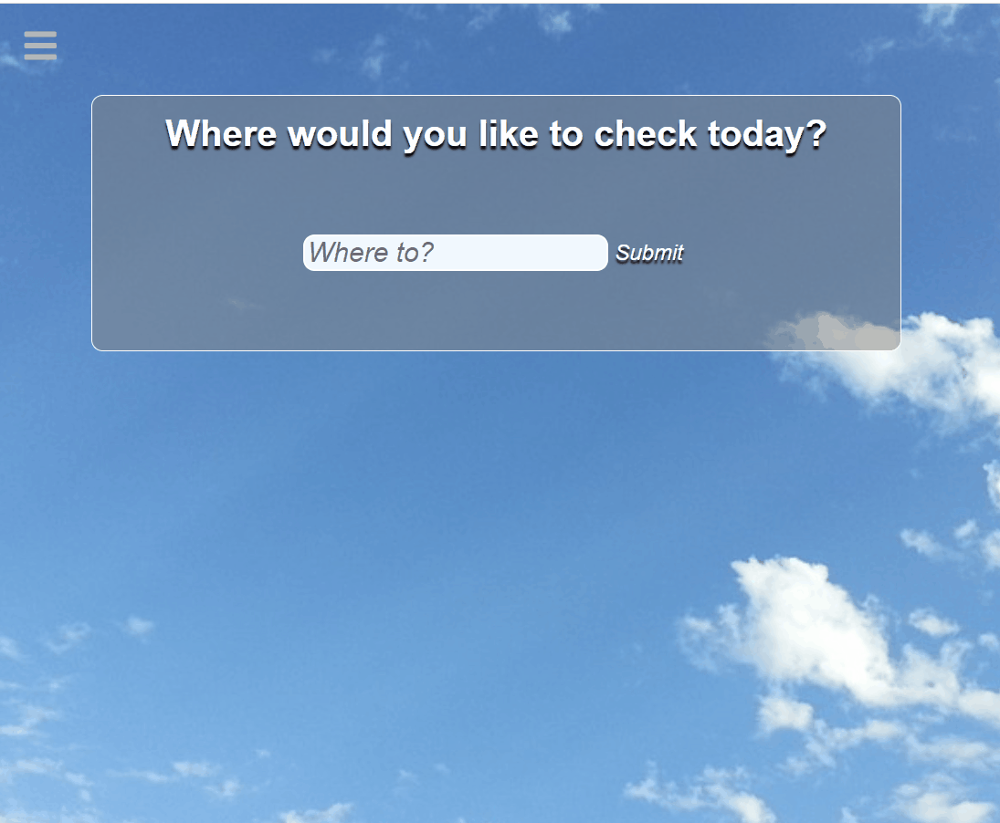

# Quick Weather

This is a web application for busy planners who want to check the weather quickly.

This was my first front end application that used HTML, CSS, and JavaScript. I wanted to make something that was simple enough, but also useful in my daily life. One of the things that I thought would be handy would be a weather app that gave me the information that I wanted it to give me. Thus, Quick Weather was born.

## Live Deployment Link
Try the application at: [dennymin.github.io/quick-weather/](dennymin.github.io/quick-weather/)

## Stack
HTML, CSS, JavaScript

## Features
⋅⋅* User can look up the weather in a specified location
⋅⋅* User can choose to see which weather data they want to see
⋅⋅* User can save locations that they like to check
⋅⋅* User can choose a primary location for personal preference

## Stretch Features for the Future
⋅⋅* Allow users to set backgrounds
⋅⋅* Users will be greeted with calendar related messages
⋅⋅* User can have multiple primary locations

## Preview



### Getting Started

1. Clone the repository.

    ```shell
    git clone https://github.com/dennymin/quick-weather.git
    cd quick-weather
    ```

1. Install all dependencies with NPM.

    ```shell
    npm install
    ```

1. Start the project. Once started you can view the application by opening the index.html file in your browser.
